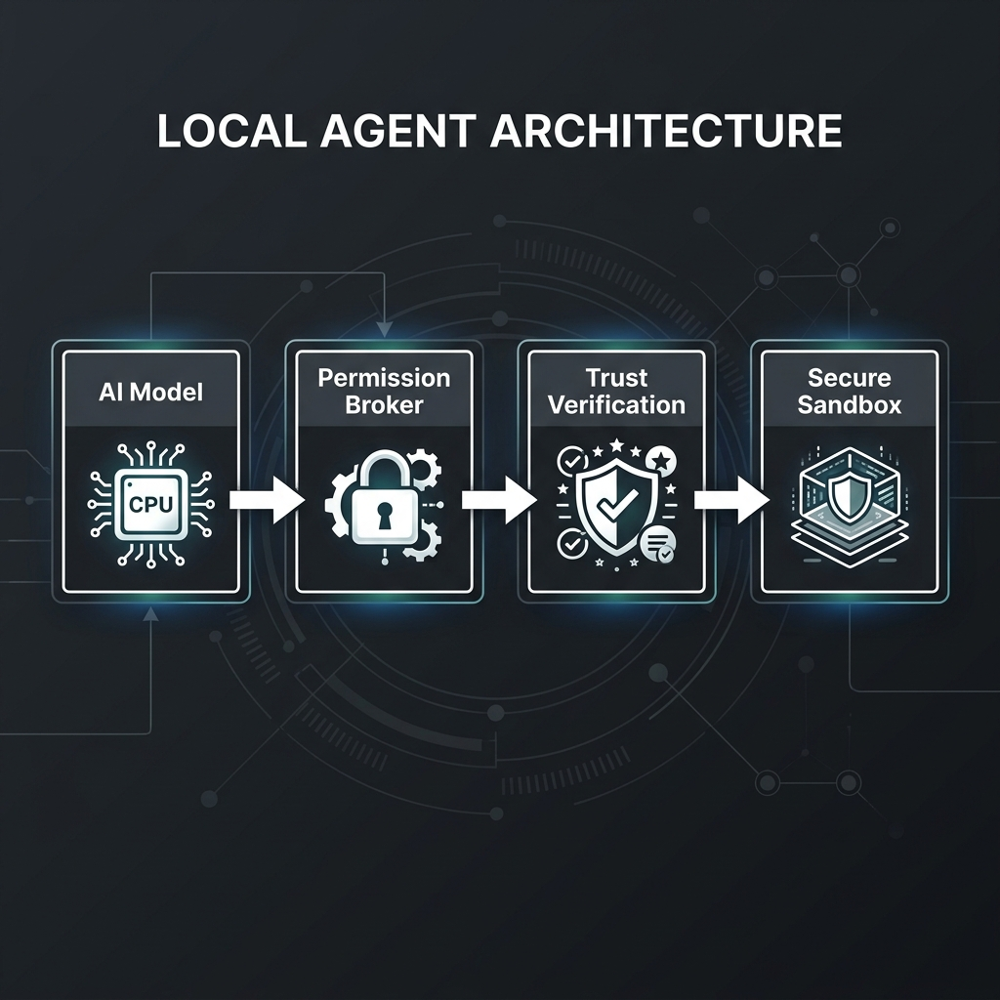
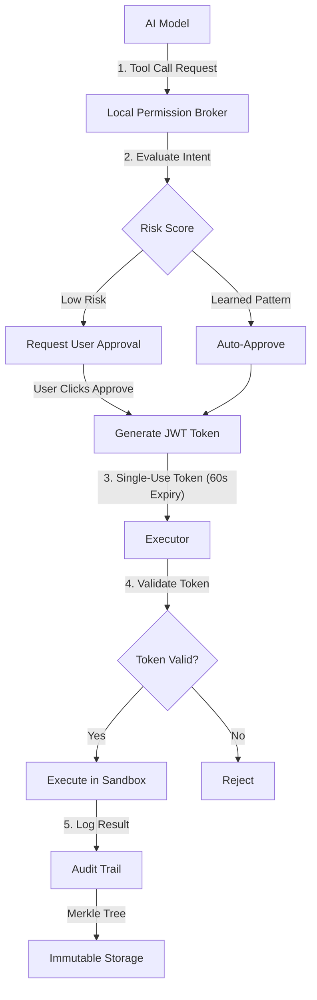
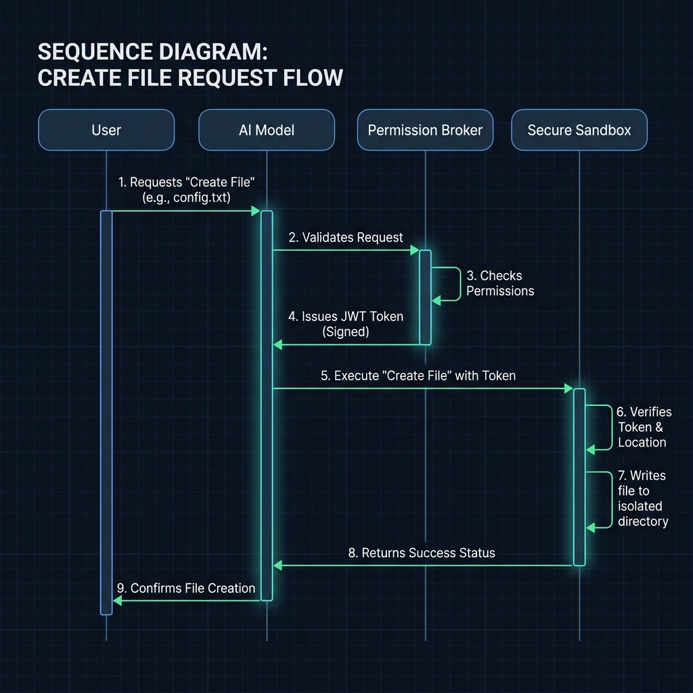
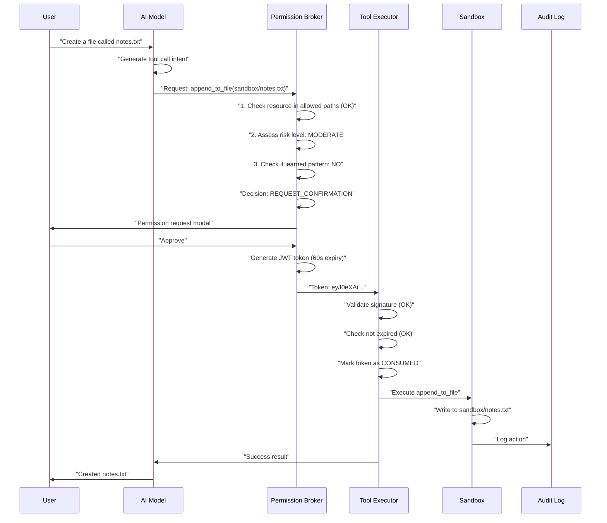

<div align="center">

# 🛡️ Local Agent


*Watch: Permission broker learns trusted patterns after 8 approvals*

[](https://opensource.org/licenses/MIT)
[](https://www.python.org/downloads/)
[](https://ollama.ai/)

[Quick Start](#quick-start) • [Architecture](#architecture) • [Security](#security-guarantees) • [Documentation](docs/) • [Contributing](#contributing)

</div>

---

## ⚡ The Problem: Local Agents Are Broken

Try giving a local AI agent tools (file operations, search, automation).

You'll quickly discover the dilemma:

| Approach | What Happens | Result |
|----------|--------------|--------|
| **No Tools** | Agent can only chat | 😴 Useless |
| **Unrestricted Access** | Agent can run any command | 💀 Dangerous |
| **Constant Confirmation** | Approve every tiny action | 😤 Unusable |

**Real examples of what goes wrong:**
- AutoGPT deletes important files when hallucinating
- LangChain agents expose API keys in logs
- Open Interpreter runs malicious code from websites

**There has to be a better way.** ✅ There is.

---

## ✨ The Solution: Local Permission Broker

Local Agent introduces the **Local Permission Broker (LPB)** — a security layer that sits between your AI model and your system.

**Think of it as an "airlock" for AI tool execution:**



<details>
<summary>📈 View Mermaid Source</summary>



</details>

### 🔑 Key Features

| Feature | Description |
|---------|-------------|
| 🎯 **Intent-Based Permissions** | Understands *what* the agent wants to do, not just which file to access |
| 🔐 **Cryptographic Tokens** | Single-use, short-lived (60s), JWT-signed — can't be replayed or forged |
| 🧠 **Auto-Learning** | After 8 approvals in 24h, trusted patterns run without confirmation |
| 📜 **Immutable Audit Trail** | Every request, approval, denial logged with timestamp — forever |
| 📦 **Secure Sandbox** | Agent operates in isolated directory, can't access system files |
| 🧬 **Semantic Memory** | Remembers context across sessions using vector embeddings |
| 🏠 **100% Local** | No cloud dependencies, your data never leaves your machine |

---

## 🚀 Quick Start (60 Seconds)

```bash
git clone https://github.com/anandkrshnn/local-agent.git
cd local-agent
pip install -e .
ollama pull phi3:mini
local-agent serve
```

Dashboard opens at **http://localhost:8000**

---

## ⚡ The Problem: Local AI Agents Are Broken

Most local AI agents face an impossible choice:

| Approach | What Happens | Result |
|----------|--------------|--------|
| **🔒 No Tools** | Agent can only chat | 😴 Useless |
| **🔓 Unrestricted Access** | Agent can run any command | 💀 Dangerous |
| **🛑 Constant Confirmation** | Approve every tiny action | 😤 Unusable |

**Real-world consequences:** Hallucinating agents deleting files, exposing API keys in logs, or running malicious scripts from the web.

---

## ✨ The Solution: Local Permission Broker

Local Agent introduces the **Local Permission Broker (LPB)** — a security "airlock" between your AI model and your system.

**The Result:** Safe automation without confirmation fatigue.

- ✅ **Intent-Based Risk Scoring**: Evaluates *what* the agent wants to do, not just which file it requests.
- ✅ **Cryptographic Tokens**: Issues single-use, 60s expiry JWT tokens that cannot be replayed or forged.
- ✅ **🧠 Auto-Learning**: After 8 approvals for a specific pattern, it's trusted and auto-approved.
- ✅ **Immutable Audit Trail**: Permanent, tamper-evident record of every decision.

---

## 🏗️ Architecture

### Security Flow



<details>
<summary>📈 View Mermaid Source</summary>



</details>

### 🧬 Semantic Memory (DuckDB + VSS)

Stores events with vector embeddings for conceptual recall:

```python
# Store
agent.store_memory("I prefer dark mode for all apps")

# Recall later with different words
agent.recall("What are my UI preferences?")
# Returns: "You prefer dark mode for all apps" (cosine similarity: 0.89)
```

---

## 🔐 Security Guarantees

### What the Agent CAN Do

✅ Read/write files in `~/local_agent/sandbox/` (with approval)  
✅ Store and recall information from semantic memory  
✅ List directory contents in allowed paths  
✅ Execute learned patterns without repeated confirmation  

### What the Agent CANNOT Do

❌ Access files outside the sandbox  
❌ Run arbitrary shell commands  
❌ Modify system files or configurations  
❌ Send data to external servers  
❌ Reuse expired or consumed tokens  

---

## 🔬 Performance Benchmarks

Tested on M2 MacBook Pro (16GB RAM):

| Model | Params | Speed | Tool Accuracy | Hallucination Rate |
|-------|--------|-------|--------------|-------------------|
| **Phi-3 Mini** | 3.8B | 28 tok/s | 94% | 6% |
| **Llama 3.2** | 3B | 31 tok/s | 92% | 8% |
| **Qwen 2.5** | 7B | 19 tok/s | 97% | 3% |

**Recommendation:** Start with Phi-3 (best balance of speed/accuracy).

---

## ⚠️ Known Limitations

This is a **working prototype** (v0.1.0), not production software for critical use:

- ❌ Single-user only (no multi-tenancy)
- ❌ Memory not encrypted at rest (plaintext DuckDB)
- ❌ Limited tool set (4 core tools)
- ❌ No cloud model support (local-only)
- ❌ Desktop/mobile apps are experimental

---

## 🗺️ Roadmap

### v0.2.0 (Target: 6 weeks)
- [ ] **Encrypted memory vault** (AES-256)
- [ ] **Multi-model switcher** (UI to change models)
- [ ] **Web search tool** (DuckDuckGo API)
- [ ] **PDF parsing tool** (local extraction)
- [ ] **Export audit logs** (CSV, JSON)

### v0.3.0 (Target: 3 months)
- [ ] Production desktop app (Tauri)
- [ ] Mobile companion for approvals
- [ ] Plugin system for community tools
- [ ] Docker deployment

---

## 🌐 Part of the Sovereign AI Ecosystem

Local Agent demonstrates the **Permission Broker pattern** at personal scale.

The same security principles scale to enterprise systems through:
- **[PTV Protocol™](https://github.com/anandkrshnn/ptv-protocol-spec)** — Open specification for cryptographically-verifiable AI agent identity
- **Sovereign AI Stack** (private) — Production implementation for healthcare, finance, government

**Learn more:** [Request evaluation access](https://github.com/anandkrshnn/ptv-protocol-spec/blob/main/docs/EVALUATION_LICENSE_REQUEST.md)

---

## 📄 License

MIT License - see [LICENSE](LICENSE) for details.
