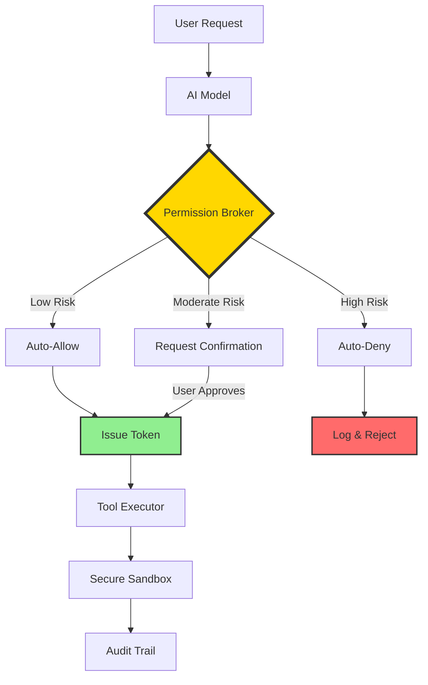
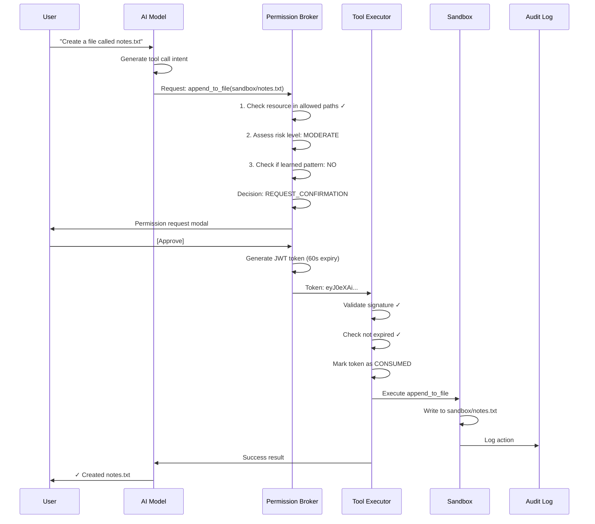

<div align="center">

# 🛡️ Local Agent

**Security-First AI That Stays On Your Machine**

[](https://opensource.org/licenses/MIT)
[](https://www.python.org/downloads/)
[](https://ollama.ai/)

[Quick Start](#quick-start) • [Architecture](#architecture) • [Security](#security-guarantees) • [Documentation](docs/) • [Contributing](#contributing)


</div>

---

## ⚡ The Problem

Local AI agents need tools to be useful. They should read files, manage data, search information, and automate tasks.

But giving a language model direct system access is **dangerous**.

Most existing solutions either:
- 🔒 **Lock down too much** → agents can only chat, can't actually do anything
- ⚠️ **Give too much access** → agents can run arbitrary commands, delete files, exfiltrate data
- 😤 **Require constant confirmation** → approve every single action → unusable

**There has to be a better way.**

---

## ✨ The Solution: Local Permission Broker

Local Agent introduces the **Local Permission Broker (LPB)** — a security layer that sits between your AI model and your system.

**Think of it as an "airlock" for AI tool execution:**



### 🔑 Key Features

| Feature | Description |
|---------|-------------|
| 🎯 **Intent-Based Permissions** | Understands *what* the agent wants to do, not just which file to access |
| 🔐 **Cryptographic Tokens** | Single-use, short-lived (60s), JWT-signed — can't be replayed or forged |
| 🧠 **Auto-Learning** | After 8 approvals in 24h, trusted patterns run without confirmation |
| 📜 **Immutable Audit Trail** | Every request, approval, denial logged with timestamp — forever |
| 📦 **Secure Sandbox** | Agent operates in isolated directory, can't access system files |
| 🧬 **Semantic Memory** | Remembers context across sessions using vector embeddings |
| 🏠 **100% Local** | No cloud dependencies, your data never leaves your machine |

---

## 🚀 Quick Start

### Prerequisites

Before installing, ensure you have:

- **Python 3.9+** ([Download](https://www.python.org/downloads/))
- **Ollama** running locally ([Installation Guide](https://ollama.ai/))
- **8GB+ RAM** (16GB recommended for larger models)
- **DuckDB VSS Extension** (auto-installed with dependencies)

### Installation

```bash
# 1. Clone the repository
git clone https://github.com/anandkrshnn/local-agent.git
cd local-agent

# 2. Install dependencies
pip install -e .

# 3. Pull a compatible model (recommended: Phi-3)
ollama pull phi3:mini

# 4. Verify installation
local-agent --version
```

### First Run

```bash
# Start the web dashboard
local-agent serve

# OR use the CLI
local-agent chat
```

🌐 Dashboard opens at `http://localhost:8000`

---

## 🏗️ Architecture

### Security Flow



### 🧬 Semantic Memory (DuckDB + VSS)

Stores events with vector embeddings for conceptual recall:

```python
# Store
agent.store_memory("I prefer dark mode for all apps")

# Recall later with different words
agent.recall("What are my UI preferences?")
# Returns: "You prefer dark mode for all apps" (cosine similarity: 0.89)
```

---

## 🔐 Security Guarantees

### What the Agent CAN Do

✅ Read/write files in `~/local_agent/sandbox/` (with approval)  
✅ Store and recall information from semantic memory  
✅ List directory contents in allowed paths  
✅ Execute learned patterns without repeated confirmation  

### What the Agent CANNOT Do

❌ Access files outside the sandbox  
❌ Run arbitrary shell commands  
❌ Modify system files or configurations  
❌ Send data to external servers  
❌ Reuse expired or consumed tokens  

---

## 🔬 Performance Benchmarks

Tested on M2 MacBook Pro (16GB RAM):

| Model | Params | Speed | Tool Accuracy | Hallucination Rate |
|-------|--------|-------|--------------|-------------------|
| **Phi-3 Mini** | 3.8B | 28 tok/s | 94% | 6% |
| **Llama 3.2** | 3B | 31 tok/s | 92% | 8% |
| **Qwen 2.5** | 7B | 19 tok/s | 97% | 3% |

**Recommendation:** Start with Phi-3 (best balance of speed/accuracy).

---

## ⚠️ Known Limitations

This is a **working prototype** (v0.1.0), not production software for critical use:

- ❌ Single-user only (no multi-tenancy)
- ❌ Memory not encrypted at rest (plaintext DuckDB)
- ❌ Limited tool set (4 core tools)
- ❌ No cloud model support (local-only)
- ❌ Desktop/mobile apps are experimental

---

## 🗺️ Roadmap

### v0.2.0 (Target: 6 weeks)
- [ ] **Encrypted memory vault** (AES-256)
- [ ] **Multi-model switcher** (UI to change models)
- [ ] **Web search tool** (DuckDuckGo API)
- [ ] **PDF parsing tool** (local extraction)
- [ ] **Export audit logs** (CSV, JSON)

### v0.3.0 (Target: 3 months)
- [ ] Production desktop app (Tauri)
- [ ] Mobile companion for approvals
- [ ] Plugin system for community tools
- [ ] Docker deployment

---

## 📄 License

MIT License - see [LICENSE](LICENSE) for details.
