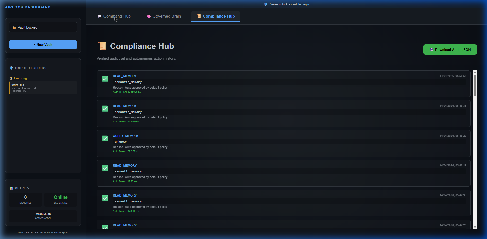
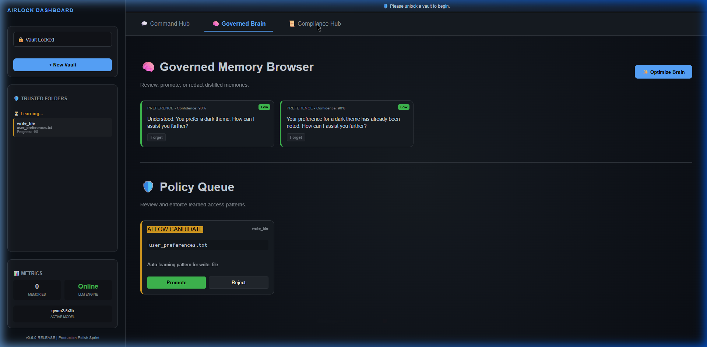
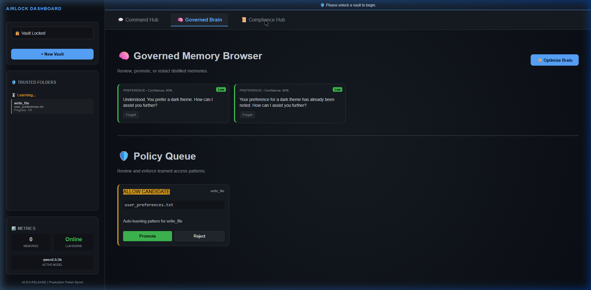

# 🛡️ LocalAgent v0.6.0 — Sovereign Local AI Agent

**PolicyEngine vaults. Deny-first governance. IETF PTV compliant. Zero cloud.**

[](https://github.com/anandkrshnn/local-agent/releases/tag/v0.6.0)

## 🚀 60-second Launch

**Docker (Recommended)**:
```bash
curl -sSL https://raw.githubusercontent.com/anandkrshnn/local-agent/main/docker-run.sh | bash
# http://localhost:8000
```

**Docker Compose**:
```bash
git clone https://github.com/anandkrshnn/local-agent
cd local-agent && mkdir vaults
docker-compose up -d
```

## ✨ Core Features

1. **PolicyEngine** — Semantic deny-first policies
2. **Airlock Gateway** — Zero-trust LLM isolation  
3. **Encrypted Vaults** — AES-256 + rotation
4. **Audit Trail** — Immutable SCITT receipts
5. **Multi-Vault** — Healthcare/Finance silos

## 🏢 Kubernetes Deployment

A minimal `k8s/` manifest suite is included for deploying `local-agent` to a cluster:

```bash
kubectl apply -f k8s/
```

The deployment:
- Uses a `PersistentVolumeClaim` to keep encrypted vaults durable across pod restarts.
- Exposes the agent via a `Service` on port 11434 (Ollama-style API).

## 🖼️ Dashboard Previews


*The Command Hub enables local-only agent control.*


*The Governed Brain surface shows policy-bound memories and vaults.*


*The Compliance Hub tracks policy-audits and vault histories.*

## 📱 Live Demo
[Watch 30s Dashboard Flow](https://github.com/anandkrshnn/local-agent/releases/download/v0.6.0/demo.mp4)

## 🤝 Enterprise / Compliance
- **IETF PTV Author** — RATS WG attested identity
- **EU AI Act / NIST** ready policy framework
- Private deployments: [Contact](mailto:ananda.krishnan@hotmail.com)

## 🙌 Community
⭐ Star if sovereign AI resonates  
🐛 Issues welcome  
💼 Enterprise: Paid support available

---
**Built by Principal Data Scientist @ Chennai** — Sovereign AI for the real world.
