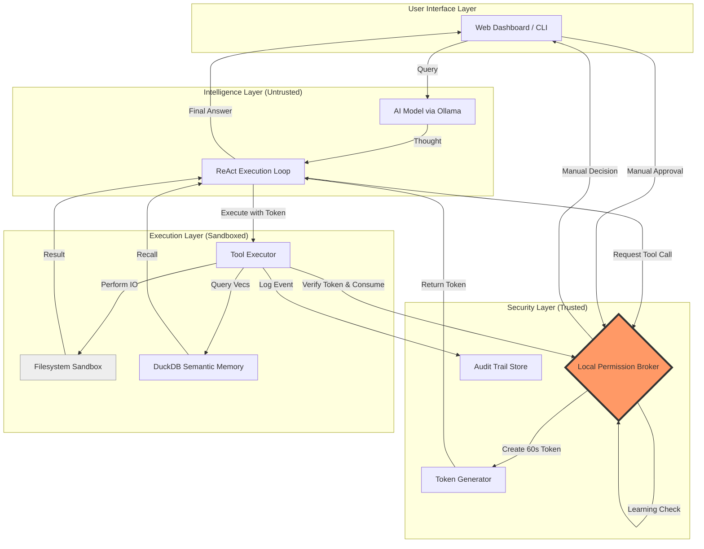

# Architecture Specification: Local Agent Security Airlock

This document details the "Security Airlock" pattern implemented via the Local Permission Broker (LPB).

## 1. High-Level Flow (Mermaid)



## 2. Component Breakdown

### 2.1 Local Permission Broker (LPB)
- **Role**: The centralized policy decision point.
- **Logic**: Implements a sliding scale of trust.
- **Auto-Learning**: Monitors the `audit_log` for repeated (8+) identical Tool + Resource patterns. If found within the sliding 24h window, it elevates the pattern to "Trusted."

### 2.2 Token-Based Protocol
- **Specification**: HMAC-SHA256 signed JSON payload.
- **Payload Structure**:
  ```json
  {
    "token_id": "uuid-v4",
    "intent": "write_file",
    "resource": "sandbox/notes.txt",
    "iat": 1712741400,
    "exp": 1712741460 
  }
  ```
- **Consumption Requirement**: The Token Executor *must* call `broker.validate_token()` which deletes the token from memory (making it single-use) before the actual I/O operation occurs.

### 2.3 Semantic Memory Stack
- **Engine**: DuckDB.
- **Index**: HNSW (Hierarchical Navigable Small World) for fast vector retrieval.
- **Embeddings**: `all-MiniLM-L6-v2` (384 dimensions).

### 2.4 Hallucination Guard
- **Mechanism**: A static whitelist of `VALID_TOOLS`.
- **Behavior**: If the LLM generates a tool call not present in the registry, the orchestrator returns a system-level error to the model's context, forcing a "Think" step to find an alternative.
